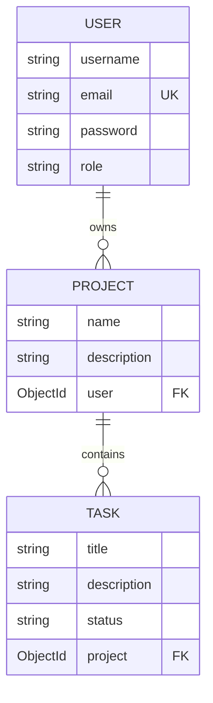
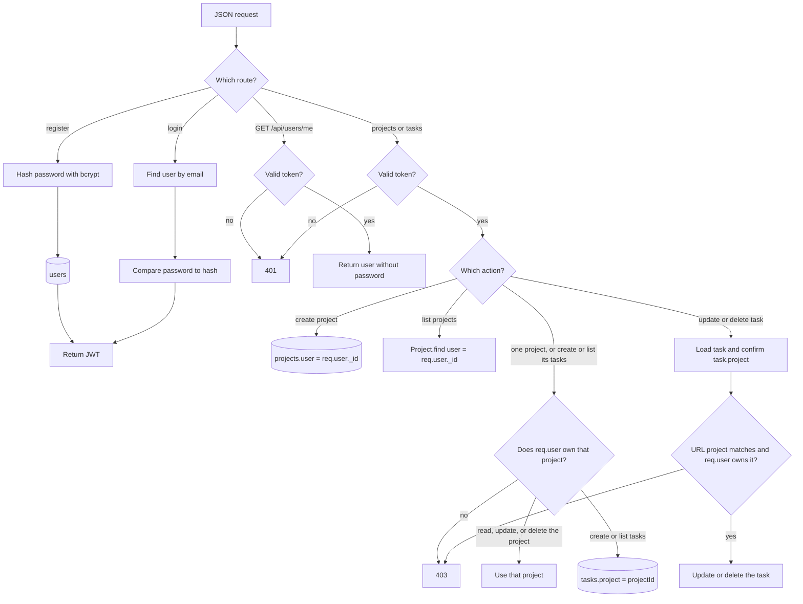
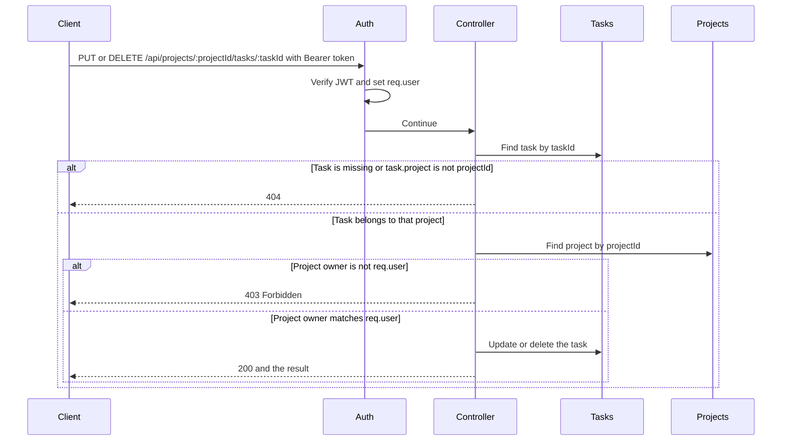

# Pro-Tasker

**Client delivery documentation**

| | |
| --- | --- |
| Product | Pro-Tasker |
| Version | 1.0 |
| Date | 8 October 2026 |
| Status | Delivered |
| Repository | https://github.com/baldemoussa/Full-Stack-MERN-Application-Pro-Tasker |

This document describes the delivered application: what it does, how a person uses it, how it is built, how to run it, and how it is deployed. It is the handover record for the client. It does not contain passwords, database credentials, or the JWT signing secret.

---

## 1. Summary

Pro-Tasker is a web application for personal project tracking. A person creates an account, adds projects, and manages each project's tasks on a three-column board: **To Do**, **In Progress**, and **Done**.

Each account sees only its own projects and tasks. The browser stores a signed token for the current tab. The server checks that token on every project and task request, then checks that the record belongs to the caller.

The delivered system has two public addresses:

| Part | Address |
| --- | --- |
| Application | https://full-stack-mern-application-pro-tasker-1.onrender.com |
| API | https://full-stack-mern-application-pro-tasker.onrender.com |

The application is a React site. The API is an Express service. Both are hosted on Render. Data is stored in MongoDB Atlas.

---

## 2. Who this is for

| Reader | What to use |
| --- | --- |
| A person using the product | Section 4, User guide, and Section 5, Workflow |
| Someone installing or hosting it | Sections 13 through 15 |
| Someone integrating with the API | Sections 6, and 9 through 11 |
| Someone working on the interface | Section 7 |
| Someone deciding later work | Sections 16 and 17 |

---

## 3. What is included

### In this version

- Register, log in, and log out.
- A session that survives a refresh in the same browser tab and ends when the tab closes or after two hours.
- Create, view, update, and delete projects.
- Create, view, update, and delete tasks under a project.
- A board with three columns. Changing a task's status moves the card.
- Deleting a project also deletes that project's tasks.
- Loading indicators while lists and saves are in progress.
- Error messages from the API, shown on the form that caused them.
- Light mode and night mode. The choice is saved in the browser.
- A layout that works on a desktop window and on a phone-width screen.
- A production deployment of the API and the application.

### Not in this version

- Shared projects, invites, or more than one owner.
- Drag-and-drop between columns. Status changes through **Edit**.
- Password reset, email verification, or profile editing.
- An admin console. The user record has a `role` field, and every new account is `user`. No screen treats `admin` differently.
- A server-side logout. Logging out removes the token in the browser. The token remains valid until it expires.
- Automated test suite. The backend `npm test` script is a placeholder.
- File uploads, comments, due dates, assignees, or notifications.

---

## 4. User guide

Open https://full-stack-mern-application-pro-tasker-1.onrender.com.

The first request after the API has been idle can take about a minute. Render's free web service sleeps when it is not in use, then wakes on the next request.

### Create an account

1. Choose **Need an account? Register**.
2. Enter a username, an email address, and a password of at least 5 characters.
3. Choose **Create account**.

The application opens the dashboard. A new account has no projects.

If the username or email is already registered, the form shows the error returned by the API.

### Log in and log out

1. Enter the email and password on **Log in**.
2. Choose **Log in**.

The header shows the username. **Log out** returns to the login page and ends the session in this tab.

A wrong email shows `Can't find this user`. A wrong password shows `Wrong password!`.

Refreshing the dashboard keeps the person signed in. Closing the tab ends the session. A token older than two hours is rejected, and the application returns to the login page.

### Projects

The left side of the dashboard is **My projects**.

- **New project** asks for a name and a description. Both are required.
- Selecting a project opens its board.
- **Edit** changes the name and description of the selected project.
- **Delete** asks for confirmation. Confirming removes the project and every task on it.

### Tasks

With a project selected, the board shows **To Do**, **In Progress**, and **Done**.

- **New task** asks for a title, a description, and a status. The status starts as **To Do**.
- **Edit** on a card changes those three fields. Choosing a different status moves the card to that column.
- **Delete** on a card asks for confirmation, then removes that task only.

Empty columns show **No tasks**.

### Appearance

The sun icon switches to night mode. The moon icon switches to light mode. The choice is kept in this browser under the name `pro-tasker-theme` and applies on the next visit, including after logout.

### Pages

| Address | What the person sees |
| --- | --- |
| `/login` | Login form. A signed-in person is sent to the dashboard. |
| `/register` | Registration form. A signed-in person is sent to the dashboard. |
| `/dashboard` | Project list and the task board. A guest is sent to login. |
| `/projects/:projectId` | A signed-in placeholder page that shows the id and **Back to projects**, which opens the dashboard. The board itself is the dashboard. |
| Any other path | Redirects to `/dashboard`. |

Refreshing `/login`, `/register`, or `/dashboard` loads the application again. Render rewrites those paths to `index.html`, and React Router chooses the page.

---

## 5. Workflow

Every change follows the same round trip. The screen never talks to MongoDB. A page calls a hook, the hook calls the API with the token, and the API writes or reads the database.

```text
Person
  -> Page (LoginPage, RegisterPage, or DashboardPage)
    -> Component (form, card, or column) collects the action
      -> Hook (useApi for writes, useFetch for reads)
        -> Token (sessionStorage, sent as Authorization: Bearer)
          -> Express route
            -> authMiddleware on protected routes
              -> Controller
                -> Mongoose model
                  -> MongoDB
  <- JSON response updates the page state
```

### Sign in

1. `LoginPage` or `RegisterPage` checks the form, then calls `login` or `register` from `useAuth()`.
2. `AuthProvider` sends the body through `useApi` to `POST /api/users/login` or `POST /api/users/register`. No token is sent yet.
3. The API checks the account, hashes a new password on register, and returns `{ token, user }`.
4. `AuthProvider` stores the token with `setToken` in `sessionStorage` and in React state.
5. `useFetch` then calls `GET /api/users/me` with `Authorization: Bearer <token>`.
6. The dashboard is shown only after `/me` returns the account. That response has no password.
7. A refresh reads the same token from `sessionStorage` and repeats step 5. Closing the tab clears `sessionStorage`. **Log out** deletes the token in the browser. The API has no logout route.

While `/me` is in progress, route guards show **Loading...**. The login and register buttons use a separate `submitting` flag, so the form stays on screen during the request.

### Open the board

1. `DashboardPage` reads `token` from `useAuth()`.
2. `useFetch` calls `GET /api/projects` with that token. Until a token exists, the URL passed to `useFetch` is `null` and no request runs.
3. The returned array is copied into the page's `projects` state. The first project is selected when none is selected yet.
4. Selecting a project changes `selectedId`. The page clears the task list, then `useFetch` calls `GET /api/projects/:projectId/tasks`.
5. `TaskColumn` receives the tasks for one status. `TaskCard` renders each task.

### Change a record

1. A button on `DashboardPage` opens a `Modal`.
2. `ProjectForm` or `TaskForm` collects the fields and calls `onSubmit` with the body. The form does not know the token or the API address.
3. The page handler calls `post`, `put`, or `del` on its `useApi` instance. That instance was created with `{ token }`, so the bearer header is added.
4. On success the hook returns the JSON record. The page appends it, replaces it, or removes it in `projects` or `tasks`. It does not send another GET.
5. On failure the hook returns `null` and keeps the API `message` on `error`. The dialog shows that message. The list on screen is left as it was.

Create and update use one `useApi` instance. Delete uses another. A delete error therefore cannot appear on the create form.

### Move a task

Editing a task and choosing **In Progress** or **Done** sends `PUT /api/projects/:projectId/tasks/:taskId` with the new `status`. The page replaces that task in state. Each column shows only the tasks whose `status` matches its heading, so the card moves without a second request.

---

## 6. Backend data workflow

A user owns many projects. A project contains many tasks. The link is stored as an id, not a nested document.



Registration writes a user. Login and `GET /api/users/me` only read that user and return a token or the account. Project and task writes happen after the token is checked.



Updating or deleting a task is the longest path, because the task document does not store the owner. The owner lives on the parent project, and the task must also belong to the project id in the URL.



`server.js` loads environment variables, creates the Express app, and opens MongoDB. The process does not listen until the connection emits `open`.

Every request then passes through the same gate before a controller runs:

```text
Incoming HTTP request
  -> CORS (allow CLIENT_URL and http://localhost:5173 when CLIENT_URL is set)
  -> express.urlencoded and express.json
  -> routes/index.js
       GET /                         health JSON, no database
       /api/*                        routes/api/index.js
       anything else                 404 HTML
```

`routes/api/index.js` mounts two routers:

| Mount | Router | Middleware |
| --- | --- | --- |
| `/api/users` | `userRoutes.js` | `authMiddleware` on `GET /me` only |
| `/api/projects` | `projectRoutes.js` | `authMiddleware` on the whole router, including nested tasks |

Task routes are registered before `GET /api/projects/:id`, so the path segment `tasks` is not treated as a project id.

### Unprotected writes: register and login

```text
POST /api/users/register
  -> registerUser
       -> User.create(req.body)
            -> pre-save hook hashes password with bcrypt (10 rounds)
       -> signToken(user)   payload { data: { username, email, _id } }, expires in 2h
       -> 201 { token, user }

POST /api/users/login
  -> loginUser
       -> User.findOne({ email })
            missing user -> 400 "Can't find this user"
       -> user.isCorrectPassword(password)
            mismatch -> 400 "Wrong password!"
       -> signToken(user)
       -> 200 { token, user }
```

No project or task is created at registration. The new user simply has an empty project list.

### Protected read: current user

```text
GET /api/users/me
  -> authMiddleware
       no token        -> 401
       invalid token   -> 401
       valid token     -> req.user = { username, email, _id }
  -> getMe
       -> User.findById(req.user._id).select('-password')
       -> 200 user, or 404 when that id is gone
```

### Project data

The owner is never taken from the client on create. The controller writes `user: req.user._id`. On update, `user` is deleted from the body before `findByIdAndUpdate`, so a caller cannot reassign a project.

```text
POST /api/projects
  -> authMiddleware
  -> createProject
       -> Project.create({ ...body, user: req.user._id })
       -> 201 project

GET /api/projects
  -> authMiddleware
  -> getAllProjects
       -> Project.find({ user: req.user._id })
       -> 200 array (empty when the caller has none)

GET, PUT, or DELETE /api/projects/:id
  -> authMiddleware
  -> load Project.findById
       missing                         -> 404
       project.user !== req.user._id   -> 403
       owned                           -> return, update, or delete
```

Delete is two writes. `Task.deleteMany({ project: project._id })` runs first. `Project.findByIdAndDelete` runs only after that. A failed ownership check deletes nothing.

### Task data

A task has no owner field. The workflow always loads the parent project and compares `project.user` with `req.user._id`. The task's `project` value comes from `:projectId` in the URL, not from the body. On update, `project` is removed from the body so a caller cannot move a task onto another project.

```text
POST /api/projects/:projectId/tasks
  -> authMiddleware
  -> load the project
       missing or not owned -> 404 or 403
  -> Task.create({ ...body, project: projectId })
  -> 201 task

GET /api/projects/:projectId/tasks
  -> authMiddleware
  -> same project ownership check
  -> Task.find({ project: projectId })
  -> 200 array

PUT or DELETE /api/projects/:projectId/tasks/:taskId
  -> authMiddleware
  -> Task.findById(taskId)
       missing, or task.project !== :projectId -> 404
  -> load the parent project and compare the owner
       not owned -> 403
  -> findByIdAndUpdate, or findByIdAndDelete
  -> 200 updated task, or { message: "Task deleted!" }
```

`status` is the only field that changes which column a task belongs to. Allowed values are `To Do`, `In Progress`, and `Done`. An unknown status fails Mongoose validation and returns **400**. The default on create is `To Do`.

### What each layer is allowed to do

| Layer | Responsibility | What it does not do |
| --- | --- | --- |
| `server.js` | CORS, JSON body, start after the database opens | No business rules |
| `routes/` | Match the URL and attach `authMiddleware` | No database calls |
| `utils/auth.js` | Verify the token and set `req.user` | No project or task checks |
| Controllers | Ownership, strip `user` or `project` from updates, choose the status code | No password hashing |
| Models | Field rules, password hash on save, password compare | No HTTP |

---

## 7. Frontend communication

The interface is split so that pages decide what happens, components display it, and hooks perform HTTP. The token is the only credential, and it lives in one place.

```text
App
  AuthProvider          holds token, user, login, register, logout
    ThemeProvider       holds light / night mode (separate from the token)
      Routes
        GuestRoute      /login, /register
        ProtectedRoute  /dashboard, /projects/:projectId
```

`AuthContext` is only the contract: the shape of `user`, `token`, `isAuthenticated`, `loading`, `submitting`, `error`, `login`, `register`, and `logout`. `AuthProvider` is the only file that fills those values. Pages call `useAuth()` and do not import the provider.

### Token

| Step | Code | Result |
| --- | --- | --- |
| Read on startup | `getToken()` in `utils/token.ts` | `sessionStorage` key `pro-tasker-token` (`VITE_TOKEN_KEY`) |
| Save after login or register | `setToken(token)` and `setTokenState` | The next refresh and the current screen both see it |
| Attach to a GET | `authHeaders(token)` | `{ Authorization: "Bearer <token>" }`, or no header when the token is null |
| Attach to a write | `useApi({ token })` | The same bearer header inside `execute` |
| Remove | `clearToken()` from `logout`, or when `/me` fails | `user` becomes null and route guards send the person to `/login` |

`isAuthenticated` is true only when `/me` has returned a user. A token by itself is not enough. `loading` is true only while a token is waiting for `/me`. `submitting` is true only while login or register is in flight. Those two flags are separate so the login form is not unmounted during submit.

Night mode does not use the token. `ThemeProvider` reads and writes `localStorage` key `pro-tasker-theme`.

### Hooks

| Hook | Methods | Who calls it | When it runs |
| --- | --- | --- | --- |
| `useApi` | `post`, `put`, `del` | `AuthProvider` for login and register. `DashboardPage` for project and task changes | Only when the page calls it |
| `useFetch` | GET | `AuthProvider` for `/api/users/me`. `DashboardPage` for projects and tasks | When its URL is a string. A `null` URL skips the request |

`useApi` prefixes `VITE_API_URL` unless the caller already passed an absolute URL. A failed response becomes `error` with the API `message` when the body has one, and the call returns `null`. `loading` is cleared in `finally`.

`useFetch` refetches when the URL or the Authorization header text changes. It clears the previous `data` as soon as that key changes, so logout cannot keep showing the previous user while the next request is still out. A response that arrives after a newer request has started is ignored.

`DashboardPage` keeps four `useApi` instances:

| Instance | Used for |
| --- | --- |
| `projectApi` | Create and update a project |
| `projectDeleteApi` | Delete a project |
| `taskApi` | Create and update a task |
| `taskDeleteApi` | Delete a task |

Each instance has its own `error` and `loading`. The spinner on **Delete project** does not replace the spinner on **Create project**.

### Pages and components

Pages own the data and the handlers. Components receive props and call back. No presentational component imports `useApi`, `useFetch`, or `token.ts`.

| Page | Reads | Calls | Renders |
| --- | --- | --- | --- |
| `LoginPage` | `login`, `error`, `submitting` | `login({ email, password })`, then `navigate("/dashboard")` | Form fields, `Alert`, `ThemeToggle` |
| `RegisterPage` | `register`, `error`, `submitting` | `register({ username, email, password })` | Form fields, `Alert`, `ThemeToggle` |
| `DashboardPage` | `token` | `useFetch` for both lists; `useApi` for every save and delete | `AppHeader`, `ProjectCard`, `TaskColumn`, `TaskCard`, `Modal`, forms |
| `ProjectPage` | The `:projectId` param | None | `AppHeader` and a back link. This is not the board |

| Component | Receives | Sends upward | Does not receive |
| --- | --- | --- | --- |
| `ProjectForm` | `initialValues`, `submitLabel`, `submitting`, `error` | `onSubmit({ name, description })`, `onCancel` | Token, project id |
| `TaskForm` | The same, plus a status field | `onSubmit({ title, description, status })` | Token, project id |
| `ProjectCard` | `project`, `selected` | `onSelect(projectId)` | The task list |
| `TaskColumn` | `status`, the tasks for that status | `onEdit`, `onDelete` | Other columns |
| `TaskCard` | One `task` | `onEdit(task)`, `onDelete(task)` | The API |
| `Modal` | `title`, `children` | `onClose` | Form state. Unmounting the modal resets the form |
| `AppHeader` | `user` and `logout` from `useAuth()` | Calls `logout`. The theme button uses `useTheme()` | Projects or tasks |
| `ProtectedRoute` | `isAuthenticated`, `loading` | Redirects guests to `/login` | — |
| `GuestRoute` | `isAuthenticated`, `loading` | Redirects a signed-in person to `/dashboard` | — |
| `Alert` | `message` | — | — |
| `Spinner` | `label` | — | — |

`DashboardPage` is the only place that connects a form submission to a URL. For example, save task does this:

```text
TaskForm.onSubmit(body)
  -> DashboardPage.handleSaveTask
       -> taskApi.put or taskApi.post
            URL includes selectedId and, for edit, the task id
            body is title, description, and status
       -> setTasks replaces or appends the returned task
       -> close the modal
```

`ProjectCard` only reports which id was clicked. The page stores that id, and the task `useFetch` runs because its URL now includes it.

---

## 8. Architecture

```text
Browser
  React application (Vite static site on Render)
        |
        |  HTTPS, JSON, Authorization: Bearer <token>
        v
  Express API (Render Web Service)
        |
        |  Mongoose
        v
  MongoDB Atlas
```

The API does not serve the React files. The static site is built with the API address baked in as `VITE_API_URL`. Changing that address requires a new frontend build.

The API listens on `process.env.PORT`, or `3001` when that variable is absent. Local development sets `PORT=3000`. Render sets `PORT` itself. The production service must not set `PORT` to `3000`.

The API connects to MongoDB before it accepts traffic. The connection string is `MONGO_URI`.

### Repository layout

```text
Backend/
  config/connection.js       MongoDB connection
  controllers/               User, project, and task handlers
  models/                    User, Project, Task
  routes/index.js            Health check, /api mount, 404
  routes/api/                /api/users and /api/projects
  utils/auth.js              Sign a token and require one
  server.js                  Express app, CORS, listen
  package.json
Frontend/
  public/                    Favicon, icons, and a redirects file
  src/components/            Header, forms, cards, columns, modal, alerts
  src/context/               Auth and theme contracts
  src/hooks/                 useApi for writes, useFetch for reads
  src/pages/                 Login, register, dashboard, project placeholder
  src/providers/             Session state and light/night mode
  src/types/index.ts         Shared TypeScript types
  src/utils/                 Token storage and auth headers
  package.json
README.md                    Short developer setup
DOCUMENTATION.md             This document
```

`Backend/.env` and `Frontend/.env` are not in the repository. `node_modules/` is not in the repository.

### Technology

| Layer | Choice | Role in this product |
| --- | --- | --- |
| Frontend | React 19, TypeScript, Vite 8 | Screens and client-side routing |
| Routing | React Router 7 | `/login`, `/register`, `/dashboard`, `/projects/:projectId` |
| Styling | Tailwind CSS 3.4 | Layout, light mode, night mode |
| Font | Nunito | Loaded from Google Fonts |
| Backend | Node.js, Express 5 | HTTP API |
| Data | Mongoose 9, MongoDB Atlas | Users, projects, and tasks |
| Passwords | bcrypt, 10 salt rounds | Hashed before save |
| Sessions | jsonwebtoken | Signed token, 2-hour expiry |
| Hosting | Render | Static site and web service |

---

## 9. Data model

MongoDB collection names follow Mongoose defaults: `users`, `projects`, and `tasks`. Every document has `_id`, `createdAt`, and `updatedAt`.

### User

| Field | Rules |
| --- | --- |
| `username` | Required, unique, trimmed |
| `email` | Required, unique, must match an email pattern |
| `password` | Required, at least 5 characters, stored as a bcrypt hash |
| `role` | `admin` or `user`. Default `user`. Not used by the screens |

The password is hashed in a pre-save hook when the user is created or the password changes. Comparison uses `isCorrectPassword`.

### Project

| Field | Rules |
| --- | --- |
| `name` | Required, trimmed |
| `description` | Required, trimmed |
| `user` | Required ObjectId reference to User. Set by the server from the token. A client cannot replace it on update |

A project list is always filtered with `{ user: req.user._id }`.

### Task

| Field | Rules |
| --- | --- |
| `title` | Required, trimmed |
| `description` | Required, trimmed |
| `status` | `To Do`, `In Progress`, or `Done`. Default `To Do` |
| `project` | Required ObjectId reference to Project. Set from the URL. A client cannot replace it on update |

A task has no owner field of its own. Ownership is the owner of its project.

### Relationships

```text
User 1 ──── * Project 1 ──── * Task
```

Deleting a project runs `Task.deleteMany({ project })` and then deletes the project. Deleting a user is not implemented, so projects are not removed when an account would be removed.

---

## 10. Security

### Authentication

- Register and login return a JWT signed with `JWT_SECRET`.
- The payload is `{ data: { username, email, _id } }`.
- Expiry is 2 hours (`expiresIn` and `maxAge`).
- Protected routes read `Authorization: Bearer <token>`. A token in `req.body.token` or `req.query.token` is also accepted by the middleware.
- Missing token: **401** `You must be logged in to do that.`
- Invalid or expired token: **401** `Invalid token.`
- The middleware sets `req.user` to `{ username, email, _id }`.

### Authorization

Project and task handlers compare `project.user` with `req.user._id`.

- Another person's record: **403** with a message that names the action, for example `User is not authorized to update this task.`
- Missing project or task: **404**.
- A task whose `project` does not match `:projectId`: **404** `No task found with this id!`, including when the task exists under a different project.

### Browser policy

When `CLIENT_URL` is set, the API allows that origin and `http://localhost:5173`. Other browser origins are rejected. Requests with no `Origin` header, such as the health check, are allowed.

When `CLIENT_URL` is unset, every origin is allowed. Local development leaves it unset. Production sets it to:

`https://full-stack-mern-application-pro-tasker-1.onrender.com`

No trailing slash. The value must match the browser origin exactly.

The application sends the token in the `Authorization` header. It does not use cookies, so CORS credentials are not enabled.

### Secrets

| Secret | Where it lives |
| --- | --- |
| `MONGO_URI` | `Backend/.env` locally, Render environment for the API |
| `JWT_SECRET` | Same |
| Database password | Inside `MONGO_URI` only |

These values are not written in this document or in the repository. Atlas network access must allow Render to connect. Render does not use one fixed address, so the cluster allows `0.0.0.0/0`.

### Client delivery notes on security

- Login and register responses include the user document returned by Mongoose, which still contains the password hash. The application does not display that field. It loads `GET /api/users/me`, and that response excludes `password`. A later release should omit the hash from the login and register JSON as well.
- There is no rate limit, account lockout, or email verification.
- Logout does not revoke the token on the server.
- Validation failures on some routes return the raw Mongoose error object with status **400**, not a single `{ message }` string.

---

## 11. API reference

Base URL in production:

`https://full-stack-mern-application-pro-tasker.onrender.com`

Send `Content-Type: application/json` for bodies. Send `Authorization: Bearer <token>` on every route except register, login, and the health check.

### Health

| Method | Path | Auth | Success |
| --- | --- | --- | --- |
| GET | `/` | No | **200** `{ "message": "Pro-Tasker API is running." }` |

Any other unknown path returns **404** and the HTML body `<h1>😝 404 Error!</h1>`.

### Users

#### POST `/api/users/register`

No token.

```json
{
  "username": "ada",
  "email": "ada@example.com",
  "password": "secret1"
}
```

**201**

```json
{
  "token": "<jwt>",
  "user": {
    "_id": "<id>",
    "username": "ada",
    "email": "ada@example.com",
    "password": "<bcrypt hash>",
    "role": "user",
    "createdAt": "<date>",
    "updatedAt": "<date>"
  }
}
```

**400** when the body fails validation, or when the username or email is already used.

#### POST `/api/users/login`

No token.

```json
{
  "email": "ada@example.com",
  "password": "secret1"
}
```

**200** with the same `{ token, user }` shape as register.

| Condition | Status | Body |
| --- | --- | --- |
| Unknown email | 400 | `{ "message": "Can't find this user" }` |
| Wrong password | 400 | `{ "message": "Wrong password!" }` |

#### GET `/api/users/me`

Token required.

**200** is the user without `password`.

**404** `{ "message": "No user found with this id!" }` when the token's id no longer matches a user.

### Projects

All of these require a token. The owner is always the caller. `user` in an update body is discarded.

#### POST `/api/projects`

```json
{
  "name": "Launch checklist",
  "description": "Work for the demo"
}
```

**201** returns the created project. **400** when `name` or `description` is missing.

#### GET `/api/projects`

**200** returns an array of the caller's projects. The array is empty when the caller has none. **500** on a database error.

#### GET `/api/projects/:id`

| Condition | Status | Message |
| --- | --- | --- |
| Found and owned | 200 | The project |
| Missing | 404 | `No project found with this id!` |
| Owned by someone else | 403 | `User is not authorized to view this project.` |

#### PUT `/api/projects/:id`

Body: `name` and `description`.

**200** returns the updated project. **404** and **403** use the messages `No project found with this id!` and `User is not authorized to update this project.`

#### DELETE `/api/projects/:id`

**200** `{ "message": "Project deleted!" }`.

Tasks with that `project` id are deleted first. **404** and **403** use `No project found with this id!` and `User is not authorized to delete this project.`

### Tasks

Task routes are registered before `/api/projects/:id`, so the word `tasks` is not treated as a project id.

All of these require a token. The server checks that the caller owns the parent project. `project` in an update body is discarded.

#### POST `/api/projects/:projectId/tasks`

```json
{
  "title": "Draft the demo script",
  "description": "Outline register, projects, and tasks",
  "status": "To Do"
}
```

`status` may be omitted and then defaults to `To Do`. Allowed values are `To Do`, `In Progress`, and `Done`.

**201** returns the created task.

| Condition | Status | Message |
| --- | --- | --- |
| Project missing | 404 | `No project found with this id!` |
| Project owned by someone else | 403 | `User is not authorized to create a task for this project.` |
| Missing title or description, or a bad status | 400 | Mongoose validation error |

#### GET `/api/projects/:projectId/tasks`

**200** returns an array of tasks for that project.

**404** `No project found with this id!`.

**403** `User is not authorized to view tasks for this project.`

#### PUT `/api/projects/:projectId/tasks/:taskId`

Body may include `title`, `description`, and `status`.

**200** returns the updated task. A new `status` is how a card changes column.

| Condition | Status | Message |
| --- | --- | --- |
| Task missing, or task belongs to another project id | 404 | `No task found with this id!` |
| Parent project missing | 404 | `No project found with this id!` |
| Caller does not own the parent | 403 | `User is not authorized to update this task.` |
| Validation failure | 400 | Mongoose validation error |

#### DELETE `/api/projects/:projectId/tasks/:taskId`

**200** `{ "message": "Task deleted!" }`.

**404** uses the same task and project messages as update. **403** is `User is not authorized to delete this task.`

### Status codes used

| Code | Meaning in this API |
| --- | --- |
| 200 | Read, update, delete, login, or health check succeeded |
| 201 | User, project, or task created |
| 400 | Validation failure, unknown email, or wrong password |
| 401 | Missing, invalid, or expired token |
| 403 | The record exists and belongs to another user |
| 404 | The record does not exist, or a task is not under the given project |
| 500 | Unexpected database error on project reads, project updates, project deletes, task lists, and task deletes. Task update errors return 400 |

---

## 12. Client application

### Environment

Create `Frontend/.env` for local development. Do not commit it.

```env
VITE_API_URL=http://localhost:3000
VITE_TOKEN_KEY=pro-tasker-token
```

Vite reads variables that start with `VITE_` at build time. Production values are set on the Render static site, not in the file above. `VITE_API_URL` has no trailing slash, because the code appends `/api/...`.

If either variable is missing, the application throws when it loads.

### Scripts

From the `Frontend` directory:

| Command | Result |
| --- | --- |
| `npm install` | Install dependencies |
| `npm run dev` | Vite dev server, usually http://localhost:5173 |
| `npm run build` | Typecheck with `tsc -b`, then production build into `dist/` |
| `npm run preview` | Serve the production build locally |
| `npm run lint` | ESLint |

### Main modules

| Module | Responsibility |
| --- | --- |
| `AuthProvider` | Token, current user, login, register, logout, loading, and submitting |
| `ThemeProvider` | Light or night mode, and the `dark` class Tailwind reads |
| `useApi` | `POST`, `PUT`, and `DELETE`. Prefixes `VITE_API_URL`, sends the bearer token, and returns `null` on failure |
| `useFetch` | `GET`. A null URL skips the request |
| `DashboardPage` | Project list, board, and the create, edit, and delete dialogs |
| `ProtectedRoute` | Guests go to `/login`. Waits while the session is restoring |
| `GuestRoute` | Signed-in people go to `/dashboard` |

`useApi` is the write path for login, register, and every project and task change. `useFetch` is the read path for `/api/users/me`, the project list, and the task list.

### Theme

`ThemeProvider` wraps the application in a `dark` class when night mode is on. Tailwind is configured with `darkMode: "class"`, so night styles apply to descendants of that class. The preference is `localStorage` key `pro-tasker-theme`, with values `dark` or `light`.

The page background is stone. Columns are white, amber, and green, and they stretch to the bottom of a desktop window. On a narrow screen the project list is height-limited, the actions stack under the title, and the columns stack vertically.

---

## 13. Local installation

Requirements: Node.js 20 or newer, npm, and a MongoDB Atlas cluster (or another MongoDB the connection string can reach).

Use two terminals. Start the API before the client.

### API

```bash
cd Backend
npm install
```

Create `Backend/.env`:

```env
PORT=3000
MONGO_URI=your-mongodb-connection-string
JWT_SECRET=your-long-random-secret
```

`PORT` defaults to `3001` if it is omitted. This project uses `3000` so it matches `VITE_API_URL`.

```bash
npm run dev
```

`npm start` runs `node server.js` without nodemon. That is the production start command.

Confirm the API with http://localhost:3000/. The body is `{ "message": "Pro-Tasker API is running." }`. `GET /api/projects` without a token returns **401**.

### Application

```bash
cd Frontend
npm install
npm run dev
```

Open the URL Vite prints, usually http://localhost:5173.

### Suggested manual check

1. Register a new account.
2. Confirm the dashboard is empty and shows the username.
3. Create a project.
4. Create a task. It appears under **To Do**.
5. Edit the task and set the status to **In Progress**. The card moves.
6. Log out. The login page appears.
7. Log in. The project and task are still there.
8. Delete the task, then delete the project.

---

## 14. Production deployment

Both services deploy from the `main` branch of https://github.com/baldemoussa/Full-Stack-MERN-Application-Pro-Tasker. The Git root contains `Frontend` and `Backend`, so each Render service sets its own root directory.

### API (Render Web Service)

| Setting | Value |
| --- | --- |
| Root directory | `Backend` |
| Build command | `npm install` |
| Start command | `npm start` |
| Health check | `GET /` returns 200 |

Environment:

| Key | Value |
| --- | --- |
| `MONGO_URI` | Atlas connection string |
| `JWT_SECRET` | Long random string |
| `CLIENT_URL` | `https://full-stack-mern-application-pro-tasker-1.onrender.com` |

Do not set `PORT`.

Live API: https://full-stack-mern-application-pro-tasker.onrender.com

### Application (Render Static Site)

| Setting | Value |
| --- | --- |
| Root directory | `Frontend` |
| Build command | `npm install && npm run build` |
| Publish directory | `dist` |

Environment, set before the build:

| Key | Value |
| --- | --- |
| `VITE_API_URL` | `https://full-stack-mern-application-pro-tasker.onrender.com` |
| `VITE_TOKEN_KEY` | `pro-tasker-token` |

Rewrite rule, under **Redirects/Rewrites**:

| Source | Destination | Action |
| --- | --- | --- |
| `/*` | `/index.html` | Rewrite |

Render does not apply a `_redirects` file by itself. The file `Frontend/public/_redirects` is published, and the dashboard rule above is what keeps `/dashboard` and `/login` from returning 404 on refresh. Real files, including JavaScript and CSS, are still served as files.

Live application: https://full-stack-mern-application-pro-tasker-1.onrender.com

### After a code change

Push to `main`. Render rebuilds the service whose files changed. A change to `VITE_API_URL` or `VITE_TOKEN_KEY` takes effect only after the static site is rebuilt. A change to `CLIENT_URL`, `MONGO_URI`, or `JWT_SECRET` takes effect when the API service redeploys. Changing `JWT_SECRET` signs out every existing token.

### Operational limits of the free tier

- The API sleeps when idle. The first request after sleep can take about a minute. The static site does not sleep.
- Render bandwidth and build minutes follow the workspace's free allowance.
- There is one API instance. It is not configured for multiple regions or automatic failover.

---

## 15. Operations

### Confirm the live system

1. Open the API root. Expect `{ "message": "Pro-Tasker API is running." }`.
2. Open `GET /api/projects` with no token. Expect **401**.
3. Open the application, register or log in, and confirm a project list loads.
4. Refresh `/dashboard`. Expect the board, not a host 404.

### Logs

Render keeps build and runtime logs for each service. The API prints `App is listening on localhost:<port>` after MongoDB connects. An invalid token prints `Invalid token` on the server and returns **401** to the client.

### Backup and data

Data lives in the Atlas cluster named by `MONGO_URI`. Render disks do not store projects or tasks. Backup, restore, and user deletion are Atlas and future-application concerns. This version has no export screen and no delete-account route.

### Development data

Accounts and sample projects created during development are in the same database the live API uses. Before a production launch for a real audience, review the `users`, `projects`, and `tasks` collections and remove records that should not remain.

---

## 16. Known limitations

- Login and register JSON includes the password hash. See Section 10.
- `role` is stored and unused.
- `/projects/:projectId` is not the task board.
- There is no password reset.
- There is no automated test suite.
- Some database errors are returned as the raw error object.
- Mongoose `findByIdAndUpdate` is called with `{ new: true }`. Current Mongoose warns that this option should be `returnDocument: 'after'`. Behavior is unchanged: the handler returns the updated document.
- The free API cold-starts.
- Collaboration and drag-and-drop are out of scope for 1.0.

---

## 17. Possible later work

These items were recorded as future work. They are not part of this delivery.

- Invite other registered users to a project, with view or edit permission.
- Drag a task from one column to another instead of editing its status.
- Omit the password hash from login and register responses.
- Password reset and email verification.
- Remove an account and its projects and tasks.
- Automated API and interface tests.

---

## 18. Handover checklist

| Item | Delivered |
| --- | --- |
| Source repository | https://github.com/baldemoussa/Full-Stack-MERN-Application-Pro-Tasker |
| Live application | https://full-stack-mern-application-pro-tasker-1.onrender.com |
| Live API | https://full-stack-mern-application-pro-tasker.onrender.com |
| API health check | `GET /` returns the running message |
| Auth, projects, and tasks | Implemented and checked against the live API |
| Owner-only access | 401 without a token, 403 for another owner's record |
| Light and night mode | Saved in the browser |
| Desktop and phone layout | Columns fill a desktop window and stack on a narrow screen |
| Refresh on `/dashboard` and `/login` | Rewrite to `index.html` |
| This document | `DOCUMENTATION.md` |
| Secrets in the repository | None. `.env` files stay on the machine and on Render |

The Render account, the Atlas cluster, and the GitHub repository remain with the owner who created them. Transferring those accounts is a separate step from this document.
